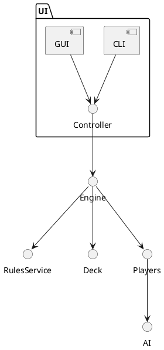

# JUno

[]()
[]()
[]()
[]()


JUno is a Java implementation of the UNO card game designed with solid object-oriented principles and a layered architecture. The project separates the core game engine, rules and services, AI players, and front-end modules. It demonstrates applied design patterns (Factory, Strategy, Observer, Command) and uses the Model-View-Controller (MVC) pattern to keep the UI modular and replaceable.

Table of Contents
- Overview
- Highlights
- Architecture & Design
- Features
- Quick Start
  - Requirements
  - Build
  - Run
- Configuration
- Gameplay (short)
- AI & Strategies
- Extending JUno
- Tests & CI
- Contributing
- Roadmap
- License
- Credits & Contact

Overview
--------
JUno implements UNO's core mechanics while focusing on maintainability, testability, and extensibility. The project is intended for:
- learning and demonstrating design patterns in a real-world game
- experimenting with AI strategies
- creating modular front-ends (CLI, Swing/JavaFX, web frontend)

Highlights
----------
- Clean separation: engine, services/rules, AI, UI
- Design patterns: Factory (card & player creation), Strategy (AI decision-making), Observer (event propagation), Command (player actions / undo)
- MVC-friendly so UIs can be swapped without changing the engine
- Modular AI: plug-in strategies to experiment with playing techniques

Architecture & Design
---------------------
High level layers:
- Core Engine: game state, turn flow, card effects
- Rules / Services: penalty handling, validation, scoring
- AI: pluggable Strategy implementations for CPU players
- Front-end: CLI, GUI, or headless execution that communicates with the engine via controllers

Recommended architecture diagram (add to docs/images/architecture.png):


Design Patterns used
- Factory — to create and configure cards, decks and players
- Strategy — to encapsulate different AI behaviors
- Observer — to propagate game events to UIs, logs and analytics
- Command — to model player actions (play, draw, pass) and support undo if needed
- MVC — decouples UI from game model for multiple front-ends

Features
--------
- Full UNO rule support (plus configurable rule toggles)
- Multiple AI strategies (random, heuristic, aggressive, conservative)
- Turn timer support for interactive play
- Pluggable front-ends (CLI implemented; add Swing/JavaFX or web)
- Unit tests for core game logic
- Extensible card and rules engine for custom game variants

Quick Start
-----------

Requirements
- Java 11+ (Java 17 recommended)
- Maven 3.6+ or Gradle (Maven examples below)
- Git

Build (Maven)
```bash
# clone
git clone https://github.com/GCRA101/JUno.git
cd JUno

# build
mvn clean package
```

Run (packaged jar)
```bash
# if build produces target/juno.jar
java -jar target/juno.jar
```

Run (from IDE)
- Open the project in IntelliJ IDEA or Eclipse.
- Run the main class: com.gcra101.juno.App (example — replace with actual main class if different).
- Use the application arguments to choose front-end, e.g. --ui=cli or --ui=gui.

Configuration
-------------
Configuration lives in config/application.properties (create if absent). Example:
```properties
# config/application.properties
game.maxPlayers=4
game.startingHandSize=7
ai.strategy.default=heuristic
ui.mode=cli
network.enabled=false
log.level=INFO
```

Gameplay (short)
----------------
- Standard UNO rules apply: match by color or number/symbol, special cards (Skip, Reverse, Draw Two, Wild, Wild Draw Four)
- The engine validates plays, enforces Draw penalties, and checks win conditions
- Custom rule toggles allow alternative sequences or scoring

AI & Strategies
---------------
The AI subsystem provides several strategies:
- RandomStrategy — picks a random legal card
- HeuristicStrategy — prioritizes cards to reduce hand size and block opponents
- AggressiveStrategy — prioritizes Draw/Skip/Reverse to target opponents
- DefensiveStrategy — tries to hold Wild cards for critical moments

To add a strategy, implement the interface:
```java
public interface PlayStrategy {
    Card chooseCard(GameState state, Player player);
}
```

Extending JUno
--------------
Common extension points:
- Add new UI: implement the controller/view contract and register the view
- Add new AI: implement PlayStrategy and register via factory or service loader
- Add custom rules: extend RulesService and inject behavior into the engine
- Add network play: implement a network adapter that forwards player commands to the engine

Testing & Continuous Integration
-------------------------------
- Unit tests cover core engine and rules. Run:
```bash
mvn test
```
- Add GitHub Actions workflow (/.github/workflows/ci.yml) to run tests on PRs
- Recommended checks: mvn -DskipTests=false verify, static analysis (SpotBugs/Checkstyle)

Contribution
------------
We welcome contributions. Please follow these guidelines:
1. Fork the repository and create a topic branch: feature/..., fix/..., docs/...
2. Write clear commit messages and keep commits focused.
3. Add or update unit tests for changes to logic.
4. Open a Pull Request against `main` with:
   - Title describing purpose
   - Description of what changed and why
   - Screenshots (if UI) and small usage examples
5. Follow the project's code style (Google Java Style / checkstyle)

Suggested Developer Workflow
- git checkout -b feature/ai-heuristic
- implement code & tests
- mvn test
- push and open PR

Roadmap
-------
Planned improvements:
- GUI (JavaFX) reference implementation
- Networked multiplayer
- More advanced AI using MCTS
- Plugin system for custom variants
- Docker image for running headless tournaments

License
-------
This repository currently does not contain a license. For broad community adoption, consider adding an OSI-approved license such as MIT or Apache-2.0.

Example: add LICENSE file with MIT text.

Changelog
---------
See CHANGELOG.md for release notes and major changes (create as the project evolves).

Assets & Images
---------------
Add these assets to docs/images/:
- hero.png — project hero image (screenshot of UI or card art)
- architecture.png — high level architecture diagram (PlantUML or diagram)
- gameplay.gif — short animated gameplay demo

PlantUML example (save as docs/diagrams/architecture.puml):

Generate PNG: plantuml docs/diagrams/architecture.puml

Contact & Credits
-----------------
Maintainer: GCRA101 — https://github.com/GCRA101
If you use this project or have suggestions, please open an issue or a PR.

Acknowledgements
- UNO game rules specification
- Inspiration from community projects that demonstrate clean architecture and design patterns

Footer
------
Thank you for checking out JUno. Whether you're here to learn design patterns, build an AI, or extend the game with a new UI, we hope this project is a useful and well-structured starting point.
